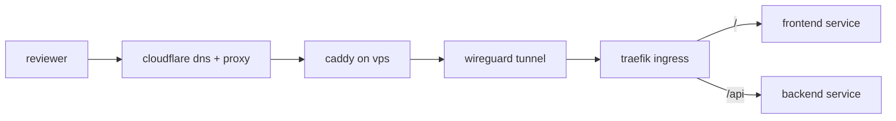

## intro

the idea for this project came from seeing how platforms like vercel and railway generate preview deployments for pull requests with very little setup. what stood out to me most was the developer experience: a pull request turns into a live url without much manual work. i liked that workflow, but i also wanted to understand how much of it i could recreate on infrastructure i controlled.

### why self hosted?

around this time, i had started building out a home server on a mini pc and was looking for projects that would help me learn tools like kubernetes in a practical way. a self-hosted preview system felt like a good fit because it combined both goals: build something genuinely useful while also working through the harder infrastructure questions that hosted platforms abstract away, like networking, exposure, and server hardening.

### what problem does this aim to solve?

reviewing changes that happen in multi-service applications requires more than just reading diffs. code reviews often require reviewers to pull code locally and verify whether the changes actually work. that adds additional friction to the review process which, in the best case, slows down feedback, and in the worst case leads to reviews not getting proper end-to-end validation.

this project aims to make the workflow simpler by turning pull requests into live preview environments with minimal setup through a small yaml configuration file. the goal is to support repositories that are more complex than a typical static site or frontend app, without assuming a specific framework or a hosted deployment platform.

## architecture

